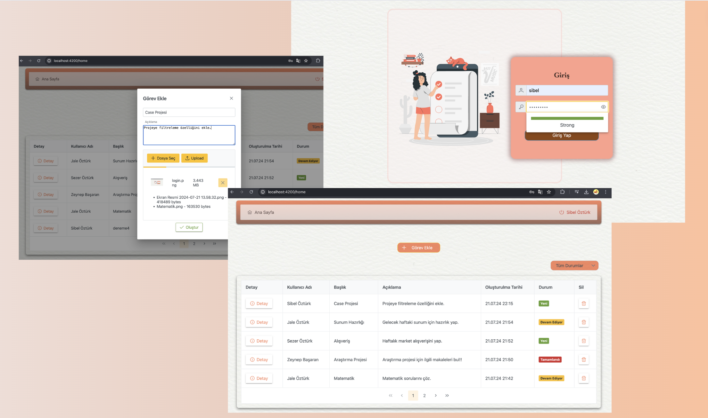

# Case Project 
### Görev Yönetim Sistemi, Dosya Yükleme ve Kullanıcı Rol Yönetimi

## Kullanılan Teknolojiler

 - **Frontend:**
  Angular 17, PrimeNg

 - **Backend:**
   .Net 8, JWT, FluentValidation, Identity Kütüphanesi

 ## Proje Detayları
 
 - Identity Kütüphanesi ile kullanıcı kayıt ve rol kontrolü sağlandı.
 - Kullanıcıların şifreyi art arda 3 kez hatalı girmesi durumunda sistemin 8 dakika boyunca kilitlenmesi için SignInManager kullanıldı.
 - Kimlik doğrulama için JWT kütüphanesi.
 - Fluent Validation ile doğrulama kuralları belirtildi.
 - Kullanıcı arayüzünü güçlendirmek için PrimeNg Kütüphanesi kullanıldı.
 - Fotoğraf yükleyebilmek için FormData kullanıldı.
 - Adminin diğer kullanıcılara ait görevleri takip edebilmesi ve görev durumuna göre listeleyebilmesi sağlandı.
 - Kullanıcıların görev oluşturabilmeleri, fotoğraf yükleyebilmeleri, güncelleme ve silme işlemleri yapabilmeleri sağlandı.

## Proje Görseli

